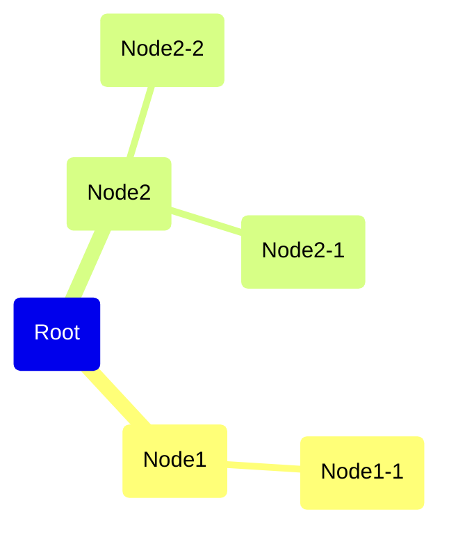

# Idea Creation

It is assumed that you have sufficient knowledge. __If you are thinking
about something you are unfamilir with, you should start by expanding
your knowledge__.

## Assumption Reversal

1. List assumptions (e.g. stereotypes, preconceptions)
2. Challenge fundamental assumptions by reversing them
3. Consider how to accomplish each reversal

## SCAMPER

SCAMPER refers to a series of thought sparkers or provocations which
help you to innovate on an existing product, service or situation by
looking through different lenses.

SCAMPER is useful when you'd like to reconstruct the idea from a
different perspective and generate derivative ideas.

- Substitute
- Combine
- Adapt
- Modify (Also Magnify and Minify)
- Put to another use
- Eliminate
- Rearrange

## Mind Map



## Mandal Art

Put your main topic in the center and devide it into 8 elements. For
each element, list 8 elements.

```plain
----------------------------------------------
|    |    |    |    |    |    |    |    |    |
----------------------------------------------
|    | E1 |    |    | E2 |    |    | E3 |    |
----------------------------------------------
|    |    |    |    |    |    |    |    |    |
----------------------------------------------
|    |    |    | E1 | E2 | E3 |    |    |    |
----------------------------------------------
|    | E8 |    | E8 | T  | E4 |    | E4 |    |
----------------------------------------------
|    |    |    | E7 | E6 | E5 |    |    |    |
----------------------------------------------
|    |    |    |    |    |    |    |    |    |
----------------------------------------------
|    | E7 |    |    | E6 |    |    | E5 |    |
----------------------------------------------
|    |    |    |    |    |    |    |    |    |
----------------------------------------------
```
