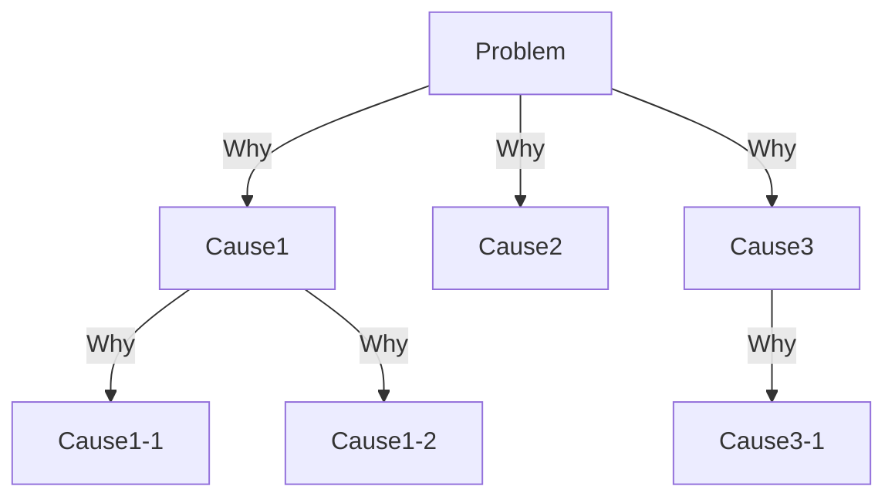
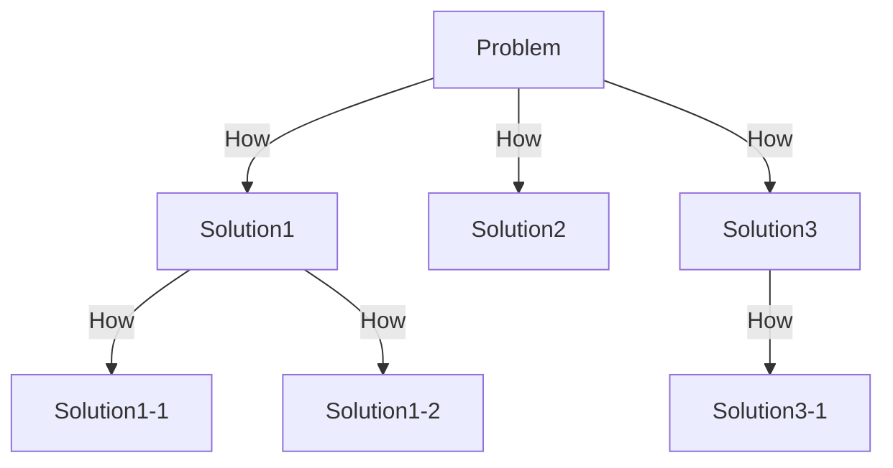
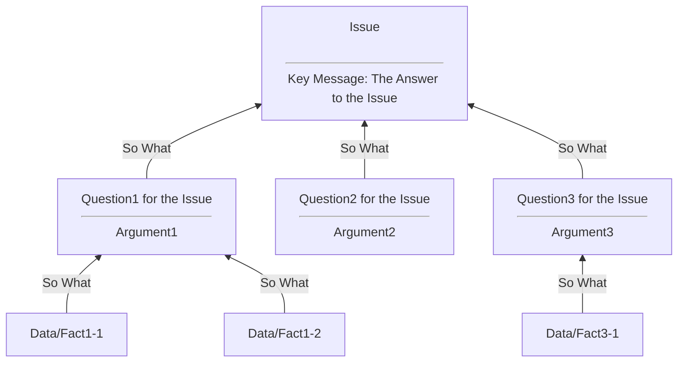

# Logic Tree

There are two types of logic trees: diagnostic ones and solution ones.

## Diagnostic Tree

Diagnostic trees break down a "why" key question, identifying all the
possible root causes for the problem.

## Solution Tree

Solution trees break down a "how" key question, identifying all the
possible alternatives to fix the problem.

# Pyramid Structure

Your thinking should form a pyramid structure that cascades down from a
single, top-level thought. Below that top-level thought sit your
arguments, and below your arguments sit your supporting data.

Pyramid structure can be used for the purpose of organizing your
arguments and testing the validity of your claims.

## How to Construct Pyramid Structure

### 1. Define the issue and answer to it

The issue and the answer to it should be defined first.

Communicate your answer, conclusion or recommendation immediately, not
at the end.

When you construct pyramid structure for communication like negotiation,
it is better to define the issue from the listener point of view.

### 2. List the questions that need to be clarified to answer the issue

Business framework is a good reference for listing good questions.

### 3. Group and sequence your arguments

Group similar insights into the same argument and be thoughtful about
how to sequence your arguments.

### 4. Support your arguments with data

Ensure that you have data that supports every argument and prevents your
reader from disputing them.

## How to validate a written document

Here is the steps to validate a written document.

### 1. Is the issue defined and consistently cared?

### 2. Are the questions for the issue appropriate?

### 3. Is evidence for each argument enough?

### 4. Are the negative aspects also being mentioned?

### 5. Adequately prepared for counterarguments?

### 6. Easy to read from logical and visual perspective?

Following CREC (Conclusion -> Reason -> Evidence/Example -> Conclusion)
is the one of the option to make a text easy to understand.
