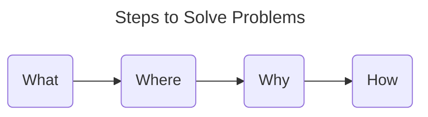

# Steps to Solve Problems

## 1. What: Clarify the Problem

What is the problem? How serious is the problem?

This is likely the gap between reality and ideal.

## 2. Where: Identify Where the Problem Lies

Identify the source of the problem.

The following approaches are relatively effective.

- Break down the element into variables
    - e.g. `Sales Revenue = Number of Units Sold * Average Price per
      Unit`
- Think in terms of processes
    - e.g. ... -> Enter the restaurant -> Get a seat -> Order -> ...

## 3. Why: Investigate the Reason Why the Problem Occurs

[Diagnostic tree](./logical_thinking.md) can be utilized to list the
possible causes.

## 4. How: How to Solve the Problem

[Solution tree](./logical_thinking.md) can be utilized to list the
possible options.

When deciding which method to use, it is a good idea to determine the
criteria for judgment as follows.

|Option|Criteria1|Criteria2|Criteria3|
|----|----|----|----|
|Option1|O|O|X|
|Option2|X|O|O|
|Option3|O|O|O|
