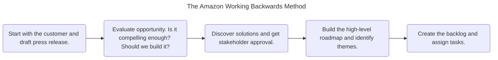

# The Amazon Working Backwards Method

Amazon's strategy is to start with a focus on the customer, and then
figure out what products to build to delight that customer.

Using the working backwards method fits perfectly with Amazon's
customer-centric approach.

## Draft Press Release

Your press release should have at least the following details:

- The product's name
- The intended customer
- The problem the product solves
- The benefits to the customer
- A quote from someone at the company explaining in an inspirational way
  why you developed the product and what you hope it will do for your
  customer
- A call to action telling the customer how to advantage of the product
  right away
- FAQ answering the business or tactical questions about building the
  product

[The template and the example of press release are available here](./working_backwards_press_release_template_example_ian_mcallister.pdf).

## Reference

- [Working Backwards Press Release Template and Example](https://www.linkedin.com/pulse/working-backwards-press-release-template-example-ian-mcallister/)
- [アマゾンのすごい「逆算資料」。新サービス説明資料は「プレスリリース形式」で](https://forbesjapan.com/articles/detail/38145/page2)
